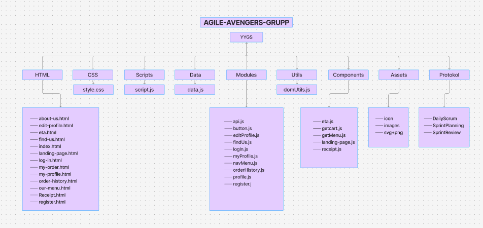

# Agile-Avengers-grupp

[Microsoft Whiteboard](https://app.whiteboard.microsoft.com/me/whiteboards/p/c3BvOmh0dHBzOi8vZnVuZXQtbXkuc2hhcmVwb2ludC5jb20vcGVyc29uYWwvM2tkeWhmZTI0X3BlcnNzdV9mb2xrdW5pdmVyc2l0ZXRldF9udQ%3D%3D/b!FW5XmYyIO0qlCwXjcQ67j_AtKQCw-k5Bh4fDWg3bUEOa2cM-Xuy6S691_ieoAW3L/01F4WWSKOCQQGNIHEUXBAYJL3U5YXWHMIN?lng=sv-se&ref=oib-80992809-ac3e-4c02-87e8-72511f251413)

## Gruppreflektioner

**Sammanfatta projektets syfte, samt era gemensamma mål**

Syftet med projektet var att prova på att jobba i ett team och lära oss hur det är att arbeta med agila metoder och att använda github och github-projects för versionshantering och sammarbete. Vi fick även möjlighet att kunna skapa en produkt helt från scratch utifrån dom user stories som vi fick, vilket också var väldigt lärorikt. 
Våra gemensamma mål var att utveckla en fungerande applikation där användare enkelt kunde navigera sig och hitta det dom ville. Vi hade också mål för varje sprint att bli klara med dom user storiesarna som vi hade valt. Dessutom var ett mål att utveckla våra färdigheter inom samarbete, problemlösning och kommunikation i ett utvecklingsteam.

**Hur upplevde teamet projektet initialt?**

När vi först möttes och gick igenom uppgiften tillsammans så kändes det ganska överväldigande och mycket information att ta in. Vi visste inte riktigt vart vi skulle börja. Det var också i stort sett första gången vi var tvungna att göra allt från scratch. Men vi bestämde oss för att ta en sak i taget och började med att brainstorma ihop för att göra det mer strukturerat. Vi började med att gå igenom user stories och dela upp vilka vi kände var viktigast. Sen byggde vi upp dom figma skisser som vi skulle behöva för att sedan börja jobba på riktigt. När vi väl hade gjort allt det i början så gick det lättare att ta sig an uppgiften.

**Beskriv hur ni inom teamet planerade projektet initialt**

Vi började som sagt med att skapa en digital whiteboard där vi skrev upp alla user stories för att sedan börja dela upp dom i lite kategorier för att sedan välja ut dom viktigaste som vi ville ha med i sprint 1. Det var lite svårt att veta i början men vi fick till det ganska bra. Efter det så hade vi en ganska klar bild på vad som behövs göras, som vilka sidor som behövs och vilka funktioner som kommer behövas. Efter det så flyttade vi över till vårat project i github för att dela upp dom i hur viktiga dom var. Vi skrev även ner en liten beskrivning i varje user story så alla hade koll på vad den skulle innehålla för funktioner osv. Vi gick sedan över till figma för att få en ännu bättre överblick på hur allt skulle byggas upp.

**Vilka steg har teamet tagit för att utveckla applikationen?**

Som det är beskrivet i den tidigare texten så började vi med en tydlig och stabil planering så att det skulle bli så smidigt och enkelt att sedan börja koda på riktigt. När vi väl började koda så byggde vi tillsammans upp en grundläggande mappstruktur med det vi visste att vi behövde så långt. Som assets med alla bilder och iconer som vi skulle använda oss av senare. Vi delade sen upp html sidor mellan oss och skapa en eller två var, plus css för den sidan. Vi började med detta för att vi kände att det skulle bli mycket enklare att börja med javascript när man ser hur allt ser ut. När dom var färdiga så var det dags att börja utveckla och skriva funktioner. Efter det men också under tiden så testade vi funktionerna och fixade buggar som uppstod. När vi hade gjort det gick vi över till små detaljer och finjusterade vår applikation.

**Vilka var de största utmaningarna för teamet?**

Vi hade inte jättestora utmaningar utan oftast flöt det på ganska bra. Men ibland kunde vi ha lite svårt med kommunikationen då vi inte alltid kunde vara onilne samtidigt utan hade lite olika tider att förhålla oss till. En annan utmaning var att dela upp arbetet på ett effektivt sätt. Eftersom vi hade olika kunskaper och erfarenheter var vissa av oss mer insatta i specifika delar av koden, vilket gjorde det svårt att fördela uppgifterna helt jämnt. Ibland kunde det också vara en utmaning att få ihop vår egen kod med andras, särskilt när vi jobbade parallellt på olika funktioner.

**Hur löste eller hanterade teamet dessa utmaningar?**

För att bli bättre på kommunikationen så gjorde vi alla vårt bästa att delta på våra daily scrums, och vara så aktiva som möjligt på discord och teams, där vi ofta skrev uppdateringar och ställde frågor till varandra även om alla ibland inte kunde vara online samtidigt. När det gällde att dela upp arbetet bättre försökte vi göra så gott vi kunde för att dela det så att det passade bäst för olika teammedlemmar, men vi såg också till att hjälpa varandra så gott vi kunde med dom olika delarna. För att undvika konflikter i koden så försökte vi pusha upp så ofta som möjligt så att ingen skrev över någon annans kod, vilket gick ganska bra, vi fick nog bara konflikter ett par gånger och då diskuterade vi hur vi på bästa sätt skulle lösa dom.

**Vilka kompromisser inom teamet har ni gjort under projektets gång?**

Under projektets gång insåg vi att vi var tvungna att göra vissa kompromisser för att hålla oss inom tidsramen och inte göra projektet onödigt krångligt. Vi hade många idéer som vi gärna hade implementerat, men vi behövde prioritera det mest nödvändiga för att få en någorlunda fungerande och produkt. Ett exempel på det var i slutet när vi höll på med administratör-delen, vi hade många olika ideer men på grund av tiden fick vi göra det på en så enkel nivå som möjligt. Men istället diskuterade vi hur vi hade kunnat göra. En annan sak var arbetsfördelning. Ibland behövde vi anpassa oss efter varandras styrkor och svagheter, vilket gjorde att vissa kanske fick ta större ansvar inom vissa områden medan andra fokuserade på andra delar. Även om försökte få det så jämt som möjligt, men vi ville hinna så långt som möjligt.

**Vad lärde sig gruppen inom projektet?**

Vi lärde oss mycket under projektets gång. En stor del var om hur viktigt det är att kommunicera för att kunna samarbeta på bästa sätt, som när man stöter på problem men också för att kunna planera på ett bra sätt. Vi lärde oss att det är jätteviktigt att fråga om hjälp om man fastnar och också att lyssna på varandras feedback var något vi blev bättre och bättre på under projektets gång, vilket gjorde att vi kunde lösa problem snabbare och förbättra koden tillsammans. Vi lärde oss om att samarbeta i team men även när det gäller kod, särskilt när flera personer arbetar på ett och samma projekt. Vi lärde oss även mycket nytt om hur man använder github för versionshantering.

**Hur kan gruppen förbättra sitt samarbete framöver?**

För att förbättra vårt samarbete om projektet hade fortsatt kunde vi bli bättre på att dela upp arbetet så tidigt som möjligt så att man får en bättre överblick på vad alla ska göra, men eftersom det ibland var svårt att förutse innan hur långt alla skulle komma och vad som behövdes mellan olika delar av koden, blev det en utmaning. Framöver skulle vi även kunnat ha ännu bättre kommunikation om våra framsteg så att vi kan arbeta mer parallellt utan att behöva vänta in varandra vilket hände lite då och då. Vi skulle även ha kunnat skriva upp mer detaljerat i projektet vad som behövdes göras för varje del. 

